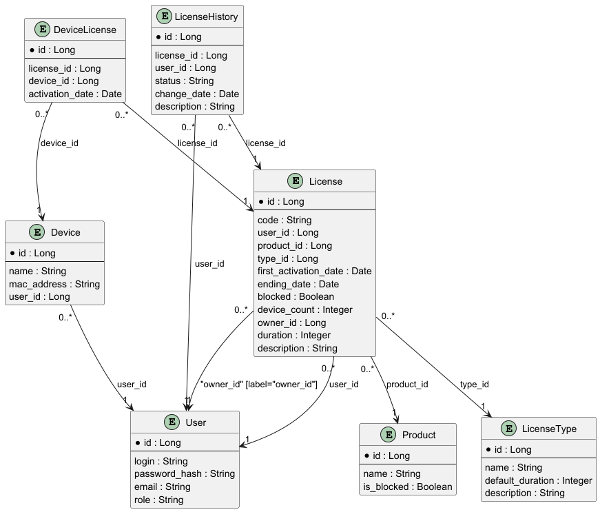
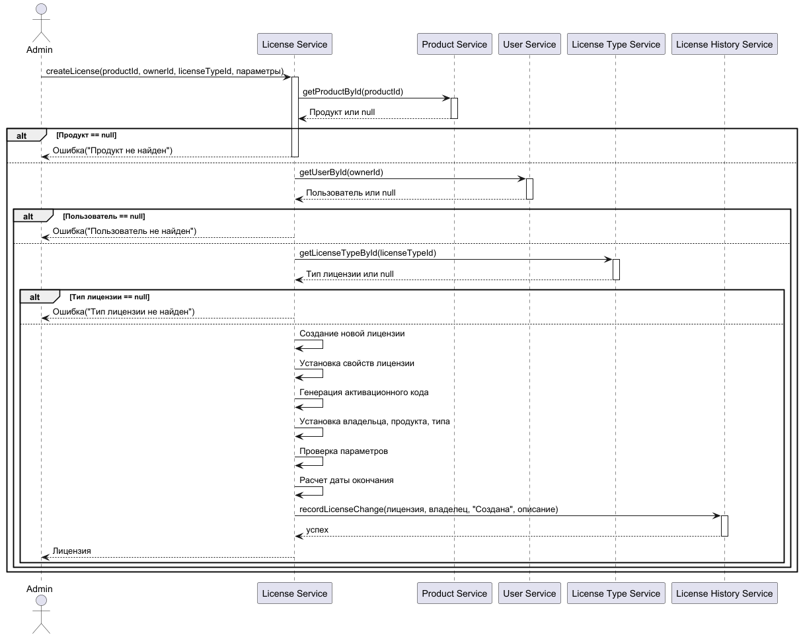
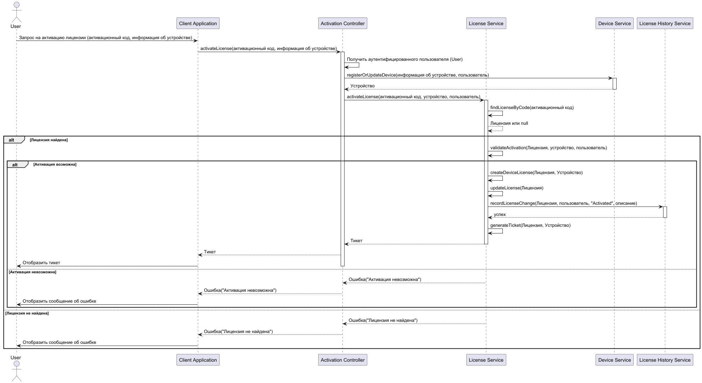
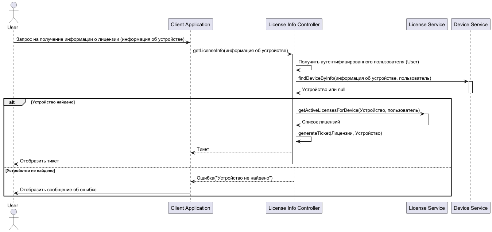
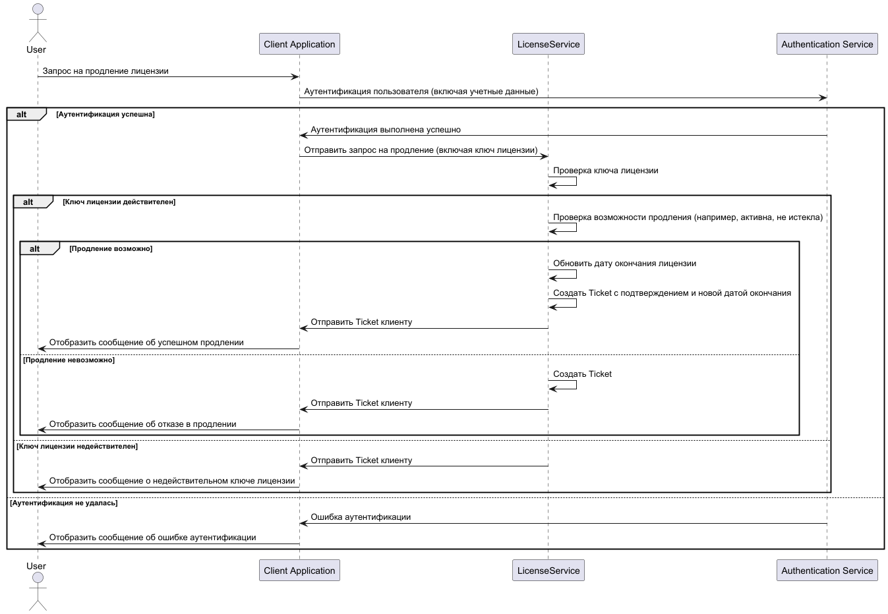

## Задание 1
1. Создать Java проект с фреймворком Spring Boot версии 3.3.x;
2. Опубликовать его на Github;
3. (*) Создать простые контроллеры, чтобы посмотреть, как с ними можно работать.

## Задание 2
1. Подключить к проекту базу данных (PostgreSQL/MySQL);
2. Создать сущности пользователя и лицензии, создав между ними связь Один Ко Многим;
3. Реализовать контроллеры для управления пользователями и лицензиями.

## Задание 3
1. Реализовать недостающие методы в классе `JwtTokenProvider`;
2. Реализовать недостающий метод в классе `JwtTokenFilter`;
3. Реализовать возможность получения токенов.

## Задание 4
1. Расширить таблицу лицензий, добавив:
    - Дату активации лицензии
    - Дату истечения лицензии
    - Флаг блокировки лицензии
    - Строковый идентификатор устройства
2. Добавить таблицу `Products`, в которой определить 2 свойства: название и флаг блокировки;
3. Реализовать возможность регистрации пользователей;
4. Создать класс `Ticket` для передачи информации о лицензии клиентам. Тикет должен состоять из:
    - Текущей даты сервера
    - Времени жизни тикета
    - Даты активации лицензии
    - Даты истечения лицензии
    - Идентификатора пользователя
    - Идентификатора устройства
    - Флага блокировки лицензии
    - Цифровой подписи

## Задание 5
Реализовать в коде следующую структуру таблиц

## Задание 6
Реализовать логику работы подсистемы лицензирования. Схемы основных процессов показаны ниже.

## Диаграмма создания лицензии

## Диаграмма активации лицензии

## Диаграмма проверки лицензии

## Диаграмма обновления лицензии

## Задание 7
Завершить WEB-сервис. Подготовить проект к демонстрации  
Проверить работоспособность функционала:
* Добавление пользователей;
* Аутентификация на основе JWT токенов;
* Поддержка CRUD операций для всех сущностей сервиса;
* Работа подсистемы лицензирования;

## Задание 8
1. Сгенерировать цепочку сертификатов минимум с тремя звеньями;
2. Переключить свой сервис на работу с TLS;
3. Добавить сертификат в доверенные, чтобы браузер нормально с ним работал.

## Задание 9
1. Модифицировать классы, работающие с JWT, добавив возможность работы с Access/Refresh токенами;
2. Для каждой активное сесии выдавать пару одноразовых Access/Refresh токенов, при повторном использовании Refresh токена блокировать все сесиии;
3. Создать таблицу для хранения информации о токенах и сессиях (Структура будет добавлена позже);
4. Реализовать оптимистическую блокировку для доступа к таблице сессий и её обработку в коде.

## Задание 10
1. Создать таблицу для работы с сигнатурами;
2. Создать таблицы для работы с аудитом;
3. Реализовать механизмы сохранения и получения сигнатур;
4. Реализовать API для доступа к записям;
5. Реализовать механизмы ведения версий сигнатур и аудита;
6. Реализовать выполнение задачи проверки подписи сигнатуры по расписанию. (пока задавать время константой)
7. Добавить оптимистическую блокировку к таблице сигнатур*

## Задание 11
1. Создать эндпоинт для получения файлов сигнатур и манифеста в формате multipart/mixed;
2. Файл манифеста должен содержать следующие данные:  
   2.1. Целое число - количество строк сигнатур, которые будут переданы в данных;  
   2.2. Массив данных в формате GUID:digital_signature каждой передаваемой сигнатуры;  
   2.3. ЭЦП манифеста, основанное на пунктах 2.1 и 2.2.
3. Файл данных должен содержать записи сигнатур из БД в бинарном формате, за исключением полей digital_signature, updated_at и status;
4. ВНИМАТЕЛЬНО следите за порядком и форматом записи байт на стороне сервера, т.к. на стророне клиента формат и порядок должен быть СТРОГО такой же;  
